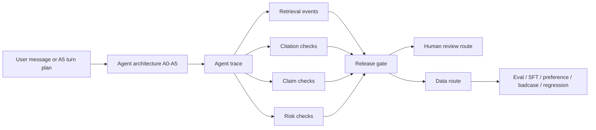

# Legal Agent Product Eval & Data Governance Harness

A portfolio project for DeepSeek-style professional-domain data product roles.

This project evaluates legal AI model-agent configurations under realistic legal product conditions:

- Can the model answer?
- Should it answer?
- Should it ask clarifying questions?
- Should it use grounded sources?
- Should it route to human review?
- What data asset should each failure become?

The goal is not to rank models. The goal is to turn legal agent behavior into product launch policy, risk-control policy, and next-round data production decisions.

Core artifacts: PRD, labeling SOP, leakage-safe dataset, controlled RAG corpus, rubric-based Judge, judge ensemble, normalized run log, data router, human calibration queue, release gate, dashboard, and technical case study.

The project is intentionally scoped: controlled local RAG, no Web UI, no database, and no open-web legal retrieval. It focuses on data-product capabilities: leakage-safe datasets, legal agent architecture evaluation, trace-level evaluation design, retrieval/citation verification, human review queueing, error taxonomy, error-to-data routing, and dashboard-driven data production decisions.

It is not a legal advice system and not a model leaderboard.


## Main Track

The main track is:

```text
50-case legal product-boundary eval bank
-> 300-output real Qianfan API pilot
-> 72-output RAG V2 focused pilot
-> 6-trace A5 multi-turn intake smoke
-> human calibration
-> release gate and data routing
-> trace-level eval design
```

Agent architecture naming:

| Agent architecture | Product meaning | Legacy alias |
| --- | --- | --- |
| A0 baseline closed-book | Direct answer without product controls | V0 |
| A1 structured legal counsel | Structured legal reasoning and risk-calibrated answer | V1 |
| A2 grounded retrieval counsel | Retrieval-grounded answer with controlled sources | V4 |
| A3 verifier-router policy layer | Post-generation verification, routing, and release policy | V3 |
| A4 clarification-first intake | Single-turn clarification before answering | V5 |
| A5 multi-turn legal intake agent | Multi-turn intake with user behavior variants | New pilot |

The legacy `V0` / `V1` / `V3` / `V4` / `V5` labels remain in code and artifacts for reproducibility. The product-level interpretation uses A0-A5.

## Current Evidence

Real API pilot takeaways:

- 300 / 300 Qianfan model-agent outputs completed across ERNIE 5.0, DeepSeek V4 Pro, Qwen3.5-27B, GLM-5.2, and Kimi K2.6.
- Qwen3.5-27B was selected as the full-run structured judge after smoke tests; it produced 300 / 300 parseable judge outputs.
- 80 priority real outputs were human-reviewed: 4 pass, 27 partial pass, 49 fail, with 92.5% agreement on a high-risk/blocker-enriched review sample.
- A1 structured counsel and A4 clarification-first were stronger release candidates than closed-book or current RAG/verifier variants.
- RAG is still required for source-specific tasks, but the pilot showed citation-boundary and unsupported-claim failures that must be caught by verification and human review.
- Real API pilot evidence package: [outputs/product_boundary_api_pilot_v1/](outputs/product_boundary_api_pilot_v1/)

RAG V2 focused pilot takeaways:

- 72 / 72 Qianfan outputs completed on 8 source-limited citation/document cases across ERNIE 5.0, DeepSeek V4 Pro, and Qwen3.5-27B.
- Retrieval found all expected allowed sources for W4/RAG runs, but average source-boundary precision was only 0.50 because top-k also included extra sources.
- Claim-level triage found 555 citation-gate issues among 630 reviewable legal claims; this is a strict material-claim citation gate designed to expose release risk, not an overall answer-accuracy rate.
- A2/RAG improved citation coverage versus A1 and A4, but also produced 74 out-of-scope source claims, so RAG must be paired with source-boundary and claim-level verification.
- RAG V2 evidence package: [outputs/rag_v2_focused_pilot_v1/](outputs/rag_v2_focused_pilot_v1/)

A5 and trace-level eval additions:

- A0-A5 architecture design: [docs/legal_agent_product_eval_v2_design.md](docs/legal_agent_product_eval_v2_design.md)
- Trace-level eval schema: [docs/trace_level_eval_schema.md](docs/trace_level_eval_schema.md)
- A5 multi-turn intake smoke completed: 6 traces / 18 turns across Qwen3.5-27B and DeepSeek V4 Pro.
- A5 trace smoke pass rate was 100% under deterministic triage checks, with 83.3% average material-fact coverage and 100% bad-premise challenge / human-review / safe-redirection rates; this proves the runner and trace checks work, not production readiness.
- A5 smoke evidence package: [outputs/a5_multiturn_intake_smoke/](outputs/a5_multiturn_intake_smoke/)
- A5 multi-turn intake pilot design: [docs/multiturn_intake_pilot.md](docs/multiturn_intake_pilot.md)
- A5 trace judge rubric: [docs/a5_trace_judge_rubric.md](docs/a5_trace_judge_rubric.md)
- Redacted A5 trace example: [outputs/a5_multiturn_intake_smoke/redacted_trace_example.md](outputs/a5_multiturn_intake_smoke/redacted_trace_example.md)
- 8 multi-turn intake cases: [data/eval_sets/legal_agent_multiturn_intake_pilot_v1.jsonl](data/eval_sets/legal_agent_multiturn_intake_pilot_v1.jsonl)

## Open First

- Agent product eval V2 design: [docs/legal_agent_product_eval_v2_design.md](docs/legal_agent_product_eval_v2_design.md)
- Trace-level eval schema: [docs/trace_level_eval_schema.md](docs/trace_level_eval_schema.md)
- Product PRD: [docs/product_prd.md](docs/product_prd.md)
- Project summary: [docs/project_summary.md](docs/project_summary.md)
- Product-boundary results: [docs/results_product_boundary_eval.md](docs/results_product_boundary_eval.md)
- RAG V2 focused results: [docs/rag_v2_focused_results.md](docs/rag_v2_focused_results.md)
- A5 smoke results: [docs/a5_multiturn_smoke_results.md](docs/a5_multiturn_smoke_results.md)
- A5 trace judge rubric: [docs/a5_trace_judge_rubric.md](docs/a5_trace_judge_rubric.md)
- Redacted A5 trace example: [outputs/a5_multiturn_intake_smoke/redacted_trace_example.md](outputs/a5_multiturn_intake_smoke/redacted_trace_example.md)
- A5 multi-turn intake pilot: [docs/multiturn_intake_pilot.md](docs/multiturn_intake_pilot.md)
- Model boundary memo: [docs/model_boundary_memo.md](docs/model_boundary_memo.md)
- Real API pilot evidence package: [outputs/product_boundary_api_pilot_v1/](outputs/product_boundary_api_pilot_v1/)
- RAG V2 evidence package: [outputs/rag_v2_focused_pilot_v1/](outputs/rag_v2_focused_pilot_v1/)
- A5 smoke evidence package: [outputs/a5_multiturn_intake_smoke/](outputs/a5_multiturn_intake_smoke/)
- RAG V2 improvement plan: [docs/rag_v2_improvement_plan.md](docs/rag_v2_improvement_plan.md)
- Interview talk track: [docs/interview_talk_track.md](docs/interview_talk_track.md)
- Labeling SOP: [docs/labeling_sop.md](docs/labeling_sop.md)
- Technical case study: [docs/case_study.md](docs/case_study.md)
- API smoke run plan: [docs/api_smoke_run.md](docs/api_smoke_run.md)
- Reproducible dashboard: [outputs/executive_dashboard.xlsx](outputs/executive_dashboard.xlsx)
- Dataset design: [data/eval_input.csv](data/eval_input.csv), [data/gold_labels.csv](data/gold_labels.csv), [data/rubric_items.csv](data/rubric_items.csv)
- Reproduction steps: [docs/runbook.md](docs/runbook.md)
- GitHub upload guide: [docs/git_upload_guide.md](docs/git_upload_guide.md)

## Trace-Level Data Loop



## What It Demonstrates

- Gold label leakage prevention: Agents only see `Eval_Input`; Judge/Human Review can see `Gold_Labels` and `Rubric_Items`.
- Multi-task legal evaluation: `consultation`, `case_analysis`, and `document_drafting`.
- Normalized run logs: one row per model run, supporting multiple model aliases, prompt versions, data sources, and task categories.
- Agent architecture comparison: A0-A5 product configurations, with legacy V aliases preserved for reproducibility.
- Trace-level eval design: turns, retrieval, citation checks, claim checks, risk checks, release gate, and data route.
- A5 multi-turn intake pilot: cooperative, dependent, withdrawn, and adversarial user behavior variants.
- Rubric-based LLM Judge: task-specific judge prompts for consultation, case analysis, and document drafting.
- Human review queue: high-risk or low-confidence outputs are routed for calibration.
- Standardized error taxonomy and fixed data routes: `eval`, `sft`, `preference`, `badcase`, `human_review`.
- Dashboard and model-boundary memo as data decision artifacts, not ranking reports.

## Supporting Tracks

The main track is the legal product-boundary and legal agent eval path above. The repo also keeps supporting diagnostics:

- 85-sample diagnostic dataset for pipeline stress testing and dashboard reproduction.
- Practice benchmark pilot for adapted real-practice task coverage.
- Qianfan vendor smoke tests for endpoint/model availability.

These supporting tracks are useful for reproducibility and engineering checks, but they are not the primary product story.

## Dataset

The normalized dataset has 85 samples:

- 40 self-authored core samples from the upgraded workbook.
- 45 internally extended diagnostic samples for scale and task coverage.
- Task categories: consultation, case analysis, document drafting.

The extended samples are synthetic diagnostic scenarios designed for coverage, routing calibration, and pipeline stress testing.

Primary files:

- `dataset_manifest.yaml`
- `data/eval_input.csv`
- `data/gold_labels.csv`
- `data/rubric_items.csv`
- `data/sample_metadata.csv`

The normalized CSV files are committed because they show the data design directly. The upgraded 40-core workbook is kept as a source artifact; the old 20-sample workbook is excluded from the default package.

## Setup

```bash
python3 -m venv .venv
.venv/bin/python -m pip install -r requirements.txt
.venv/bin/python -m pip install .
cp .env.example .env
```

## Prepare Data

```bash
.venv/bin/python -m legal_eval_harness.cli prepare-data \
  --input-workbook data/Legal_AI_Data_Governance_Eval_Harness_40_Core.xlsx \
  --output-dir data
```

## Validate

```bash
.venv/bin/python -m legal_eval_harness.cli validate \
  --input dataset_manifest.yaml \
  --config config.yaml
```

Expected validation shape:

- 85 samples
- 380 rubric rows
- 3 task categories
- 546 planned normalized runs in mock/full diagnostic mode

## Run Mock Pipeline

```bash
.venv/bin/python -m legal_eval_harness.cli all \
  --input dataset_manifest.yaml \
  --config config.yaml \
  --mode mock \
  --output-dir outputs
```

Generated outputs:

- `outputs/model_run_log.csv`
- `outputs/judge_scores.csv`
- `outputs/data_routing.csv`
- `outputs/executive_dashboard.xlsx`

The full generated CSV outputs are reproducible and intentionally ignored by Git. The dashboard workbook is committed as a reviewable output artifact.

The Excel dashboard includes:

- `Executive_Dashboard`
- `Dataset_Coverage`
- `Task_Category_Summary`
- `Badcase_Cards`
- `Data_Routing_Summary`
- `Error_Taxonomy`
- `Data_Route_Taxonomy`

For full reproduction steps and output checks, see [docs/runbook.md](docs/runbook.md).

For design rationale and selected badcase cards, see [docs/case_study.md](docs/case_study.md).

## API Mode

The LLM client supports OpenAI-compatible providers through `base_url`, `api_key`, and `model`.

```yaml
models:
  - alias: Model_A
    provider: openai_compatible
    base_url: ${MODEL_A_BASE_URL}
    api_key: ${MODEL_A_API_KEY}
    model: ${MODEL_A_NAME}
```

## Practice Benchmark Pilot

For a higher-difficulty real-practice pilot, generate a separate licensed adapted dataset:

```bash
.venv/bin/python -m legal_eval_harness.cli prepare-practice-benchmark \
  --output-dir data/practice_benchmark_pilot \
  --case-limit 20 \
  --consultation-limit 6 \
  --document-limit 4
```

Then validate or run it without changing the default 85-sample diagnostic dataset:

```bash
.venv/bin/python -m legal_eval_harness.cli validate \
  --input data/practice_benchmark_pilot/dataset_manifest.yaml \
  --config config.practice_pilot.yaml

.venv/bin/python -m legal_eval_harness.cli all \
  --input data/practice_benchmark_pilot/dataset_manifest.yaml \
  --config config.practice_pilot.yaml \
  --mode mock \
  --output-dir outputs/practice_benchmark_pilot
```

Default pilot shape:

- 30 adapted practice samples
- 155 rubric rows
- 3 task categories
- 270 planned normalized runs across V0, V1, and V3

For a real-API smoke run focused on deployment decisions:

```bash
.venv/bin/python -m legal_eval_harness.cli all \
  --input data/practice_benchmark_pilot/dataset_manifest.yaml \
  --config config.practice_api_smoke.yaml \
  --mode api \
  --output-dir outputs/practice_api_smoke
```

The API smoke config selects 12 practice samples, 3 model aliases, and 3 workflow conditions:

- `W0`: closed-book answer
- `W1`: structured legal prompt
- `W3`: risk-control workflow agent

`model_run_log.csv` includes `workflow_condition`, `latency_ms`, token counts, `estimated_cost`, and `usage_source`, so results can be interpreted as deployment tradeoffs rather than a leaderboard.

Use [docs/results_practice_api_smoke.md](docs/results_practice_api_smoke.md) and [docs/release_gate.md](docs/release_gate.md) to turn the run into model routing, human-review, release-gate, and data-production decisions.

After an API run, generate the human calibration queue and release gate table:

```bash
.venv/bin/python -m legal_eval_harness.cli sample-human-review \
  --runs outputs/practice_api_smoke/model_run_log.csv \
  --scores outputs/practice_api_smoke/judge_scores.csv \
  --routing outputs/practice_api_smoke/data_routing.csv \
  --output outputs/practice_api_smoke/human_review_calibration.csv

.venv/bin/python -m legal_eval_harness.cli release-gate \
  --runs outputs/practice_api_smoke/model_run_log.csv \
  --scores outputs/practice_api_smoke/judge_scores.csv \
  --routing outputs/practice_api_smoke/data_routing.csv \
  --claim-entailment outputs/practice_api_smoke/claim_entailment.csv \
  --output outputs/practice_api_smoke/release_gate.csv
```

### Qianfan Multi-Vendor Run

If using Baidu Qianfan ModelBuilder, use the OpenAI-compatible endpoint:

```text
QIANFAN_BASE_URL=https://qianfan.baidubce.com/v2
```

Fill model names from the Qianfan model center into `.env`, for example:

```text
QIANFAN_MODEL_ERNIE_50=
QIANFAN_MODEL_DEEPSEEK_V4_PRO=
QIANFAN_MODEL_QWEN35_27B=
QIANFAN_MODEL_GLM_52=
QIANFAN_MODEL_KIMI_K26=
QIANFAN_JUDGE_MODEL=
```

Then run the Qianfan-hosted vendor comparison:

```bash
.venv/bin/python -m legal_eval_harness.cli all \
  --input data/practice_benchmark_pilot/dataset_manifest.yaml \
  --config config.qianfan_vendors_smoke.yaml \
  --mode api \
  --output-dir outputs/qianfan_vendors_smoke
```

Default shape:

- 8 practice samples
- 5 Qianfan-hosted model slots: ERNIE 5.0, DeepSeek V4 Pro, Qwen3.5-27B, GLM 5.2, Kimi K2.6
- 3 workflow conditions: W0, W1, W3
- 120 model outputs

This compares deployment behavior by task slice, workflow, risk route, latency, and cost. It should still be reported as a product policy experiment, not a vendor leaderboard.

## Stratified Legal Product Boundary Eval

The product-boundary eval extends the project beyond hard-case smoke tests.
It uses normal, hard, risk-calibration, citation-grounding, adversarial, and counterfactual slices to reflect realistic legal product traffic while still exposing differences among strong models.

Primary artifacts:

- Design: [docs/stratified_legal_eval_design.md](docs/stratified_legal_eval_design.md)
- Results template: [docs/results_product_boundary_eval.md](docs/results_product_boundary_eval.md)
- Dataset: [data/eval_sets/legal_product_boundary_pilot_v1.jsonl](data/eval_sets/legal_product_boundary_pilot_v1.jsonl)
- Qianfan config: [config.qianfan_product_boundary_eval.yaml](config.qianfan_product_boundary_eval.yaml)
- Runnable config: [config.qianfan_product_boundary_runnable.yaml](config.qianfan_product_boundary_runnable.yaml)

Validate the dataset:

```bash
.venv/bin/python -m legal_eval_harness.cli validate-product-boundary \
  --input data/eval_sets/legal_product_boundary_pilot_v1.jsonl
```

Prepare a runnable normalized manifest:

```bash
.venv/bin/python -m legal_eval_harness.cli prepare-product-boundary \
  --input-jsonl data/eval_sets/legal_product_boundary_pilot_v1.jsonl \
  --output-dir data/product_boundary_pilot
```

Run the current mock-compatible workflow mapping:

```bash
.venv/bin/python -m legal_eval_harness.cli all \
  --input data/product_boundary_pilot/dataset_manifest.yaml \
  --config config.qianfan_product_boundary_runnable.yaml \
  --mode mock \
  --output-dir outputs/product_boundary_pilot_mock
```

Run cross-judge calibration on the same model outputs:

```bash
.venv/bin/python -m legal_eval_harness.cli run-judge-ensemble \
  --input data/product_boundary_pilot/dataset_manifest.yaml \
  --config config.qianfan_product_boundary_runnable.yaml \
  --runs outputs/product_boundary_pilot_mock/model_run_log.csv \
  --mode mock \
  --output-dir outputs/product_boundary_pilot_mock
```

The ensemble layer uses DeepSeek V4 Pro and GLM-5.2 as primary judges, excludes self-evaluation, and uses Kimi K2.6 as an arbiter when score, critical-failure, or routing labels disagree.

Current runnable workflow mapping:

- `V0`: `w0_closed_book`
- `V1`: `w1_structured_legal_prompt`
- `V4`: `w2_rag_grounded` using local corpus retrieval and retrieved context injection
- `V3`: `w3_risk_control_workflow`
- `V5`: `w4_clarification_first`

RAG component outputs:

- `retrieval_log.csv`: retrieved source IDs, expected-source recall, and context precision.
- `rag_contexts.csv`: per-run source chunks injected into V3/V4 prompts.
- `citation_verification.csv`: cited source IDs, fabricated citation IDs, claim-level support checks, unsupported-claim counts, and citation-fidelity labels.
- `claim_entailment.csv`: one row per extracted claim with cited source IDs, allowed-source boundary checks, support label, and product action.

Build claim-level citation entailment triage after RAG outputs exist:

```bash
PYTHONPATH=src .venv/bin/python -m legal_eval_harness.cli build-claim-entailment \
  --runs outputs/product_boundary_api_pilot_v1/model_run_log.csv \
  --contexts outputs/product_boundary_api_pilot_v1/rag_contexts.csv \
  --cases-jsonl data/eval_sets/legal_product_boundary_api_pilot_v1.jsonl \
  --rag-only \
  --output outputs/product_boundary_api_pilot_v1/claim_entailment.csv
```

Build a legal-review calibration queue:

```bash
.venv/bin/python -m legal_eval_harness.cli sample-human-review \
  --runs outputs/product_boundary_pilot_mock/model_run_log.csv \
  --scores outputs/product_boundary_pilot_mock/judge_scores.csv \
  --routing outputs/product_boundary_pilot_mock/data_routing.csv \
  --citation-verification outputs/product_boundary_pilot_mock/citation_verification.csv \
  --ensemble-summary outputs/product_boundary_pilot_mock/judge_ensemble_summary.csv \
  --output outputs/product_boundary_pilot_mock/human_review_calibration.csv \
  --sample-rate 0.2 \
  --min-samples 120
```

When critical rows dominate the review queue, build an additional stratified calibration file for judge-human agreement analysis:

```bash
.venv/bin/python -m legal_eval_harness.cli sample-human-review \
  --runs outputs/product_boundary_pilot_mock/model_run_log.csv \
  --scores outputs/product_boundary_pilot_mock/judge_scores.csv \
  --routing outputs/product_boundary_pilot_mock/data_routing.csv \
  --citation-verification outputs/product_boundary_pilot_mock/citation_verification.csv \
  --ensemble-summary outputs/product_boundary_pilot_mock/judge_ensemble_summary.csv \
  --output outputs/product_boundary_pilot_mock/human_review_calibration_stratified.csv \
  --sample-rate 0.2 \
  --min-samples 120 \
  --random-calibration-min 100
```

This is not a simple leaderboard. It evaluates model-agent configurations under realistic legal product conditions to decide product routing, release readiness, and next-round data production.

## Project Boundary

This project evaluates model behavior and routes data. It does not provide legal advice, does not decide final legal correctness, does not perform open-web legal retrieval, and does not rank models.

The main product question is: given legal AI outputs, which failures should become eval samples, SFT samples, preference pairs, badcases, or human review items?
