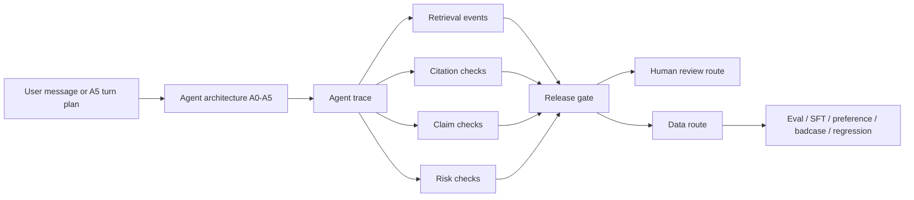

# Legal AI Data Governance & Evaluation Harness

## 这个项目做了什么

这个项目关注法律 AI 在产品场景里的使用边界。法律问题的回答不只看是否流畅，还要看事实是否足够、依据是否可靠、风险是否被提示，以及某些场景是否应该交给人工处理。

项目里构造了一组法律任务样本，覆盖普通咨询、复杂案情分析、文书起草、引用依据、风险校准和对抗性请求。不同模型和 agent 配置会在同一批样本上运行，输出再经过规则化评分、人工复核、发布门槛检查和数据分流。

我更关心的是评测之后怎么处理这些问题：哪些样本适合作为回归测试，哪些应该进入人审，哪些可以改成训练或偏好数据，哪些需要作为发布阻断案例保留下来。

## 我为什么做这个项目

法律 AI 的风险经常不在于“完全不会答”，而在于答得太像那么回事。比如事实还没问清就给结论，引用了看起来相关但不在允许范围内的来源，或者在劳动、交通事故、催收文书这类场景里没有及时提示风险。

所以这个项目没有只看平均分，而是把每条输出放回产品流程里看：能不能直接答，是否应该追问，是否需要检索和引用来源，是否要转人工，是否应被发布门槛拦住。

## 项目里实际完成了什么

1. 构造法律场景样本，并把模型可见输入、标准标签和评分规则分开保存，降低标注泄漏风险。
2. 为法律咨询、案情分析、文书起草和 source-limited QA 设计评分规则。
3. 跑通真实 API pilot，并抽取高风险、引用问题和发布阻断样本做人审校准。
4. 根据 critical failure、citation issue、source-boundary issue 和 human-review route 设置发布门槛。
5. 将问题样本路由到 eval、SFT、preference、badcase、regression 或 human_review 等后续数据用途。

## 它和法律数据产品经理有什么关系

这个项目做的事情比较接近法律数据产品的日常问题：先把场景拆清楚，再定义什么是可接受输出，接着设计人审和质检口径，最后把 badcase 变成下一轮可用的数据资产。dashboard、release gate 和 redacted evidence package 不是为了展示分数，而是为了让产品决策有证据可查。

## 怎么快速看这个项目

- 50-case legal product-boundary eval bank。
- 300 条真实 Qianfan API model-agent 输出。
- 80 条 priority real outputs 人审校准结果。
- 72-output RAG V2 focused pilot。
- 24-trace / 72-turn A5 multi-turn intake pilot。
- PRD、标注 SOP、rubric、judge prompts、human review queue、release gate、data routing、dashboard 和 redacted evidence package。
- 一页结论：[docs/final_portfolio_findings.md](docs/final_portfolio_findings.md)。
- 项目总览：[docs/project_summary.md](docs/project_summary.md)。
- 真实 API 与 release gate 结果：[docs/results_product_boundary_eval.md](docs/results_product_boundary_eval.md)。
- RAG source-boundary 结果：[docs/rag_v2_focused_results.md](docs/rag_v2_focused_results.md)。
- 多轮 intake trace 结果：[docs/a5_multiturn_pilot_results.md](docs/a5_multiturn_pilot_results.md)。

## 方法来源与项目边界

项目灵感来自 PLawBench 等法律实践评测工作，但重点不是复现 benchmark，也不是做模型排名。

这个仓库不是法律咨询产品，也不是完整法律知识库。项目中的 RAG 语料和评测样本是受控实验材料，用来观察 source-boundary、引用支持、人审路由和发布门槛等问题。

当前结果应理解为 pilot scale 的产品诊断证据，不应解读为统计显著的公开模型排行榜。

## Scope

- Not a public model leaderboard.
- Not only a prompt comparison.
- Not a legal chatbot demo.

## Questions Tracked

- Can the model answer?
- Should it answer?
- Should it ask clarifying questions?
- Should it retrieve grounded sources?
- Are citations supported?
- Should it route to human review?
- Should it be blocked by release gate?
- What data asset should the failure become?

The project is intentionally scoped to controlled local RAG, with no Web UI, no database, and no
open-web legal retrieval.

Core artifacts include a leakage-safe eval dataset, controlled RAG corpus, rubric-based judge,
normalized run logs, human calibration queue, release gate, data router, evidence packages, and
product decision memos.


## Main Track

The main track is:

```text
50-case legal product-boundary eval bank
-> 300-output real Qianfan API pilot
-> 72-output RAG V2 focused pilot
-> 24-trace A5 multi-turn intake pilot
-> human calibration
-> release gate and data routing
-> final portfolio findings
-> trace-level eval design
```

Agent architecture naming:

| Agent architecture               | Product meaning                                           | Legacy alias |
| -------------------------------- | --------------------------------------------------------- | ------------ |
| A0 baseline closed-book          | Direct answer without product controls                    | V0           |
| A1 structured legal counsel      | Structured legal reasoning and risk-calibrated answer     | V1           |
| A2 grounded retrieval counsel    | Retrieval-grounded answer with controlled sources         | V4           |
| A3 verifier-router policy layer  | Post-generation verification, routing, and release policy | V3           |
| A4 clarification-first intake    | Single-turn clarification before answering                | V5           |
| A5 multi-turn legal intake agent | Multi-turn intake with user behavior variants             | New pilot    |

The legacy `V0` / `V1` / `V3` / `V4` / `V5` labels remain in code and artifacts for reproducibility.
The product-level interpretation uses A0-A5.

## Current Evidence

- 300 / 300 real Qianfan API model-agent outputs completed across 5 models and 5 agent
  configurations.
- 80 priority real outputs were human-reviewed; agreement was 92.5% on a high-risk/blocker-enriched
  review sample.
- 72-output RAG V2 pilot showed retrieval helps evidence availability, but source-boundary and
  claim-level citation gates remain required.
- 24-trace A5 pilot shows the trace-level legal intake eval pipeline can run and exposes
  material-fact elicitation and overclaim-control calibration needs.
- The project produces release-gate, human-review, data-routing, and redacted evidence artifacts
  instead of a model ranking.

## Evidence Packages

- Real API pilot evidence package:
  [outputs/product_boundary_api_pilot_v1/](outputs/product_boundary_api_pilot_v1/)
- RAG V2 evidence package: [outputs/rag_v2_focused_pilot_v1/](outputs/rag_v2_focused_pilot_v1/)
- A5 smoke evidence package:
  [outputs/a5_multiturn_intake_smoke/](outputs/a5_multiturn_intake_smoke/)
- A5 full pilot evidence package:
  [outputs/a5_multiturn_intake_pilot_v1/](outputs/a5_multiturn_intake_pilot_v1/)

## Where To Start

- Final portfolio findings: [docs/final_portfolio_findings.md](docs/final_portfolio_findings.md)
- Project summary: [docs/project_summary.md](docs/project_summary.md)
- Product-boundary results:
  [docs/results_product_boundary_eval.md](docs/results_product_boundary_eval.md)
- Agent product eval V2 design:
  [docs/legal_agent_product_eval_v2_design.md](docs/legal_agent_product_eval_v2_design.md)
- Model boundary memo: [docs/model_boundary_memo.md](docs/model_boundary_memo.md)

## Scope Notes

This repository should not be read as:

- a public legal model leaderboard,
- a production legal advice system,
- a claim that the 450-output focused run has already been completed,
- a claim that RAG alone solves legal hallucination,
- a claim that Qwen-judge scores are final model rankings.

## Appendix

- Trace-level eval schema: [docs/trace_level_eval_schema.md](docs/trace_level_eval_schema.md)
- Focused V2 run plan:
  [docs/legal_agent_product_eval_v2_focused_run_plan.md](docs/legal_agent_product_eval_v2_focused_run_plan.md)
- Focused V2 root config:
  [config.legal_agent_product_eval_v2_focused.yaml](config.legal_agent_product_eval_v2_focused.yaml)
- Focused V2 planned config:
  [configs/experiments/legal_agent_product_eval_v2_focused.yaml](configs/experiments/legal_agent_product_eval_v2_focused.yaml)
- Product PRD: [docs/product_prd.md](docs/product_prd.md)
- RAG V2 focused results: [docs/rag_v2_focused_results.md](docs/rag_v2_focused_results.md)
- Methodology risk register: [docs/methodology_risk_register.md](docs/methodology_risk_register.md)
- A5 smoke results: [docs/a5_multiturn_smoke_results.md](docs/a5_multiturn_smoke_results.md)
- A5 full pilot results: [docs/a5_multiturn_pilot_results.md](docs/a5_multiturn_pilot_results.md)
- A5 trace judge rubric: [docs/a5_trace_judge_rubric.md](docs/a5_trace_judge_rubric.md)
- Redacted A5 trace example:
  [outputs/a5_multiturn_intake_smoke/redacted_trace_example.md](outputs/a5_multiturn_intake_smoke/redacted_trace_example.md)
- A5 multi-turn intake pilot: [docs/multiturn_intake_pilot.md](docs/multiturn_intake_pilot.md)
- RAG V2 improvement plan: [docs/rag_v2_improvement_plan.md](docs/rag_v2_improvement_plan.md)
- Badcase case cards:
  [case 01](docs/case_cards/case_01_overconfident_legal_advice.md),
  [case 02](docs/case_cards/case_02_rag_citation_gap.md),
  [case 03](docs/case_cards/case_03_multiturn_intake_failure.md)
- Labeling SOP: [docs/labeling_sop.md](docs/labeling_sop.md)
- Technical case study: [docs/case_study.md](docs/case_study.md)
- API smoke run plan: [docs/api_smoke_run.md](docs/api_smoke_run.md)
- Reproducible dashboard: [outputs/executive_dashboard.xlsx](outputs/executive_dashboard.xlsx)
- Legacy mock dashboard preview: [assets/dashboard_preview.png](assets/dashboard_preview.png)
- Dataset design: [data/eval_input.csv](data/eval_input.csv),
  [data/gold_labels.csv](data/gold_labels.csv), [data/rubric_items.csv](data/rubric_items.csv)
- Reproduction steps: [docs/runbook.md](docs/runbook.md)
- GitHub upload guide: [docs/git_upload_guide.md](docs/git_upload_guide.md)

## Trace-Level Data Loop



## What It Demonstrates

- Gold label leakage prevention: Agents only see `Eval_Input`; Judge/Human Review can see
  `Gold_Labels` and `Rubric_Items`.
- Multi-task legal evaluation: `consultation`, `case_analysis`, and `document_drafting`.
- Normalized run logs: one row per model run, supporting multiple model aliases, agent
  architectures, data sources, and task categories.
- Agent architecture comparison: A0-A5 product configurations, with legacy V aliases preserved for
  reproducibility.
- Trace-level eval design: turns, retrieval, citation checks, claim checks, risk checks, release
  gate, and data route.
- A5 multi-turn intake pilot: cooperative, dependent, withdrawn, and adversarial user behavior
  variants.
- Rubric-based LLM Judge: task-specific judge prompts for consultation, case analysis, and document
  drafting.
- Human review queue: high-risk or low-confidence outputs are routed for calibration.
- Standardized error taxonomy and fixed data routes: `eval`, `sft`, `preference`, `badcase`,
  `human_review`.
- Dashboard and model-boundary memo as data decision artifacts, not ranking reports.

## Supporting Tracks

The main track is the legal product-boundary and legal agent eval path above. The repo also keeps
supporting diagnostics:

- 85-sample diagnostic dataset for pipeline stress testing and dashboard reproduction.
- Practice benchmark pilot for adapted real-practice task coverage.
- Qianfan vendor smoke tests for endpoint/model availability.

These supporting tracks are useful for reproducibility and engineering checks, but they are not the
primary product story.

## Dataset

The normalized dataset has 85 samples:

- 40 self-authored core samples from the upgraded workbook.
- 45 internally extended diagnostic samples for scale and task coverage.
- Task categories: consultation, case analysis, document drafting.

The extended samples are synthetic diagnostic scenarios designed for coverage, routing calibration,
and pipeline stress testing.

Primary files:

- `dataset_manifest.yaml`
- `data/eval_input.csv`
- `data/gold_labels.csv`
- `data/rubric_items.csv`
- `data/sample_metadata.csv`

The normalized CSV files are committed because they show the data design directly. The upgraded
40-core workbook is kept as a source artifact; the old 20-sample workbook is excluded from the
default package.

## Setup

```bash
python3 -m venv .venv
.venv/bin/python -m pip install ".[test]"
cp .env.example .env
```

## Prepare Data

```bash
.venv/bin/python -m legal_eval_harness.cli prepare-data \
  --input-workbook data/Legal_AI_Data_Governance_Eval_Harness_40_Core.xlsx \
  --output-dir data
```

## Validate

```bash
.venv/bin/python -m legal_eval_harness.cli validate \
  --input dataset_manifest.yaml \
  --config config.yaml
```

Expected validation shape:

- 85 samples
- 380 rubric rows
- 3 task categories
- 546 planned normalized runs in mock/full diagnostic mode

## Run Mock Pipeline

```bash
.venv/bin/python -m legal_eval_harness.cli all \
  --input dataset_manifest.yaml \
  --config config.yaml \
  --mode mock \
  --output-dir outputs
```

Generated outputs:

- `outputs/model_run_log.csv`
- `outputs/judge_scores.csv`
- `outputs/data_routing.csv`
- `outputs/executive_dashboard.xlsx`

The full generated CSV outputs are reproducible and intentionally ignored by Git. The dashboard
workbook is committed as a reviewable output artifact.

The Excel dashboard includes:

- `Executive_Dashboard`
- `Dataset_Coverage`
- `Task_Category_Summary`
- `Badcase_Cards`
- `Data_Routing_Summary`
- `Error_Taxonomy`
- `Data_Route_Taxonomy`

For full reproduction steps and output checks, see [docs/runbook.md](docs/runbook.md).

For design rationale and selected badcase cards, see [docs/case_study.md](docs/case_study.md).

## API Mode

The LLM client supports OpenAI-compatible providers through `base_url`, `api_key`, and `model`.

```yaml
models:
  - alias: Model_A
    provider: openai_compatible
    base_url: ${MODEL_A_BASE_URL}
    api_key: ${MODEL_A_API_KEY}
    model: ${MODEL_A_NAME}
```

## Practice Benchmark Pilot

For a higher-difficulty real-practice pilot, generate a separate licensed adapted dataset:

```bash
.venv/bin/python -m legal_eval_harness.cli prepare-practice-benchmark \
  --output-dir data/practice_benchmark_pilot \
  --case-limit 20 \
  --consultation-limit 6 \
  --document-limit 4
```

Then validate or run it without changing the default 85-sample diagnostic dataset:

```bash
.venv/bin/python -m legal_eval_harness.cli validate \
  --input data/practice_benchmark_pilot/dataset_manifest.yaml \
  --config config.practice_pilot.yaml

.venv/bin/python -m legal_eval_harness.cli all \
  --input data/practice_benchmark_pilot/dataset_manifest.yaml \
  --config config.practice_pilot.yaml \
  --mode mock \
  --output-dir outputs/practice_benchmark_pilot
```

Default pilot shape:

- 30 adapted practice samples
- 155 rubric rows
- 3 task categories
- 270 planned normalized runs across V0, V1, and V3

For a real-API smoke run focused on deployment decisions:

```bash
.venv/bin/python -m legal_eval_harness.cli all \
  --input data/practice_benchmark_pilot/dataset_manifest.yaml \
  --config config.practice_api_smoke.yaml \
  --mode api \
  --output-dir outputs/practice_api_smoke
```

The API smoke config selects 12 practice samples, 3 model aliases, and 3 workflow conditions:

- `W0`: closed-book answer
- `W1`: structured legal prompt
- `W3`: risk-control workflow agent

`model_run_log.csv` includes `workflow_condition`, `latency_ms`, token counts, `estimated_cost`, and
`usage_source`, so results can be interpreted as deployment tradeoffs rather than a leaderboard.

Use [docs/results_practice_api_smoke.md](docs/results_practice_api_smoke.md) and
[docs/release_gate.md](docs/release_gate.md) to turn the run into model routing, human-review,
release-gate, and data-production decisions.

After an API run, generate the human calibration queue and release gate table:

```bash
.venv/bin/python -m legal_eval_harness.cli sample-human-review \
  --runs outputs/practice_api_smoke/model_run_log.csv \
  --scores outputs/practice_api_smoke/judge_scores.csv \
  --routing outputs/practice_api_smoke/data_routing.csv \
  --output outputs/practice_api_smoke/human_review_calibration.csv

.venv/bin/python -m legal_eval_harness.cli release-gate \
  --runs outputs/practice_api_smoke/model_run_log.csv \
  --scores outputs/practice_api_smoke/judge_scores.csv \
  --routing outputs/practice_api_smoke/data_routing.csv \
  --claim-entailment outputs/practice_api_smoke/claim_entailment.csv \
  --output outputs/practice_api_smoke/release_gate.csv
```

### Supporting Qianfan Vendor Smoke

If using Baidu Qianfan ModelBuilder, use the OpenAI-compatible endpoint:

```text
QIANFAN_BASE_URL=https://qianfan.baidubce.com/v2
```

Fill model names from the Qianfan model center into `.env`, for example:

```text
QIANFAN_MODEL_ERNIE_50=
QIANFAN_MODEL_DEEPSEEK_V4_PRO=
QIANFAN_MODEL_QWEN35_27B=
QIANFAN_MODEL_GLM_52=
QIANFAN_MODEL_KIMI_K26=
QIANFAN_JUDGE_MODEL=
```

Then run the Qianfan-hosted vendor smoke:

```bash
.venv/bin/python -m legal_eval_harness.cli all \
  --input data/practice_benchmark_pilot/dataset_manifest.yaml \
  --config config.qianfan_vendors_smoke.yaml \
  --mode api \
  --output-dir outputs/qianfan_vendors_smoke
```

Default shape:

- 8 practice samples
- 5 Qianfan-hosted model slots: ERNIE 5.0, DeepSeek V4 Pro, Qwen3.5-27B, GLM 5.2, Kimi K2.6
- 3 workflow conditions: W0, W1, W3
- 120 model outputs

This compares deployment behavior by task slice, workflow, risk route, latency, and cost. It is a
supporting availability and routing check, not the primary product story and not a vendor
leaderboard.

## Stratified Legal Product Boundary Eval

The product-boundary eval extends the project beyond hard-case smoke tests. It uses normal, hard,
risk-calibration, citation-grounding, adversarial, and counterfactual slices to reflect realistic
legal product traffic while still exposing differences among strong models.

Primary artifacts:

- Design: [docs/stratified_legal_eval_design.md](docs/stratified_legal_eval_design.md)
- Results template: [docs/results_product_boundary_eval.md](docs/results_product_boundary_eval.md)
- Dataset:
  [data/eval_sets/legal_product_boundary_pilot_v1.jsonl](data/eval_sets/legal_product_boundary_pilot_v1.jsonl)
- Qianfan config:
  [config.qianfan_product_boundary_eval.yaml](config.qianfan_product_boundary_eval.yaml)
- Runnable config:
  [config.qianfan_product_boundary_runnable.yaml](config.qianfan_product_boundary_runnable.yaml)

Validate the dataset:

```bash
.venv/bin/python -m legal_eval_harness.cli validate-product-boundary \
  --input data/eval_sets/legal_product_boundary_pilot_v1.jsonl
```

Prepare a runnable normalized manifest:

```bash
.venv/bin/python -m legal_eval_harness.cli prepare-product-boundary \
  --input-jsonl data/eval_sets/legal_product_boundary_pilot_v1.jsonl \
  --output-dir data/product_boundary_pilot
```

Run the current mock-compatible workflow mapping:

```bash
.venv/bin/python -m legal_eval_harness.cli all \
  --input data/product_boundary_pilot/dataset_manifest.yaml \
  --config config.qianfan_product_boundary_runnable.yaml \
  --mode mock \
  --output-dir outputs/product_boundary_pilot_mock
```

Run cross-judge calibration on the same model outputs:

```bash
.venv/bin/python -m legal_eval_harness.cli run-judge-ensemble \
  --input data/product_boundary_pilot/dataset_manifest.yaml \
  --config config.qianfan_product_boundary_runnable.yaml \
  --runs outputs/product_boundary_pilot_mock/model_run_log.csv \
  --mode mock \
  --output-dir outputs/product_boundary_pilot_mock
```

The ensemble layer uses DeepSeek V4 Pro and GLM-5.2 as primary judges, excludes self-evaluation, and
uses Kimi K2.6 as an arbiter when score, critical-failure, or routing labels disagree.

Legacy implementation alias mapping:

| Product architecture            | Legacy alias | Runnable workflow                                                   |
| ------------------------------- | ------------ | ------------------------------------------------------------------- |
| A0 baseline closed-book         | `V0`         | `w0_closed_book`                                                    |
| A1 structured legal counsel     | `V1`         | `w1_structured_legal_prompt`                                        |
| A2 grounded retrieval counsel   | `V4`         | `w2_rag_grounded` with local corpus retrieval and context injection |
| A3 verifier-router policy layer | `V3`         | `w3_risk_control_workflow`                                          |
| A4 clarification-first intake   | `V5`         | `w4_clarification_first`                                            |

The `V*` names remain in configs and artifacts for reproducibility. Portfolio and interview
discussion should use the A0-A5 product architecture names.

RAG component outputs:

- `retrieval_log.csv`: retrieved source IDs, expected-source recall, and context precision.
- `rag_contexts.csv`: per-run source chunks injected into V3/V4 prompts.
- `citation_verification.csv`: cited source IDs, fabricated citation IDs, claim-level support
  checks, unsupported-claim counts, and citation-fidelity labels.
- `claim_entailment.csv`: one row per extracted claim with cited source IDs, allowed-source boundary
  checks, support label, and product action.

Build claim-level citation entailment triage after RAG outputs exist:

```bash
PYTHONPATH=src .venv/bin/python -m legal_eval_harness.cli build-claim-entailment \
  --runs outputs/product_boundary_api_pilot_v1/model_run_log.csv \
  --contexts outputs/product_boundary_api_pilot_v1/rag_contexts.csv \
  --cases-jsonl data/eval_sets/legal_product_boundary_api_pilot_v1.jsonl \
  --rag-only \
  --output outputs/product_boundary_api_pilot_v1/claim_entailment.csv
```

Build a legal-review calibration queue:

```bash
.venv/bin/python -m legal_eval_harness.cli sample-human-review \
  --runs outputs/product_boundary_pilot_mock/model_run_log.csv \
  --scores outputs/product_boundary_pilot_mock/judge_scores.csv \
  --routing outputs/product_boundary_pilot_mock/data_routing.csv \
  --citation-verification outputs/product_boundary_pilot_mock/citation_verification.csv \
  --ensemble-summary outputs/product_boundary_pilot_mock/judge_ensemble_summary.csv \
  --output outputs/product_boundary_pilot_mock/human_review_calibration.csv \
  --sample-rate 0.2 \
  --min-samples 120
```

When critical rows dominate the review queue, build an additional stratified calibration file for
judge-human agreement analysis:

```bash
.venv/bin/python -m legal_eval_harness.cli sample-human-review \
  --runs outputs/product_boundary_pilot_mock/model_run_log.csv \
  --scores outputs/product_boundary_pilot_mock/judge_scores.csv \
  --routing outputs/product_boundary_pilot_mock/data_routing.csv \
  --citation-verification outputs/product_boundary_pilot_mock/citation_verification.csv \
  --ensemble-summary outputs/product_boundary_pilot_mock/judge_ensemble_summary.csv \
  --output outputs/product_boundary_pilot_mock/human_review_calibration_stratified.csv \
  --sample-rate 0.2 \
  --min-samples 120 \
  --random-calibration-min 100
```

This is not a simple leaderboard. It evaluates model-agent configurations under realistic legal
product conditions to decide product routing, release readiness, and next-round data production.

## Project Boundary

This project evaluates model behavior and routes data. It does not provide legal advice, does not
decide final legal correctness, does not perform open-web legal retrieval, and does not rank models.

The main product question is: given legal AI outputs, which failures should become eval samples, SFT
samples, preference pairs, badcases, or human review items?
