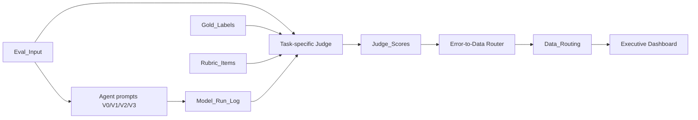

# Legal Agent Eval Harness

Two-day portfolio prototype for legal AI data-loop governance.

Target role: professional-domain AI data product manager.

Core problem: how to turn risky legal Agent outputs into reusable data assets for `eval`, `sft`, `preference`, `badcase`, and `human_review`.

Final artifacts: PRD, labeling SOP, leakage-safe dataset, rubric-based Judge, normalized run log, data router, tests, dashboard, and interview-ready case study.

The project is intentionally scoped: no RAG, no Web UI, no database, and no automatic legal citation retrieval. It focuses on data-product capabilities: leakage-safe datasets, multi-task legal evaluation, rubric-based judging, human review queueing, error taxonomy, error-to-data routing, and dashboard-driven data production decisions.

It is not a legal advice system and not a model leaderboard.


Three dashboard takeaways:

- V3 workflow responses improve structured risk-control behavior over V0 in the deterministic diagnostic run.
- The largest operational queue is human review, which is expected for high-risk or low-confidence legal outputs.
- Top data actions are preference pairs for overclaim control, evidence-risk SFT samples, and high-risk review calibration.

## Open First

- Product PRD: [docs/product_prd.md](docs/product_prd.md)
- Labeling SOP: [docs/labeling_sop.md](docs/labeling_sop.md)
- Portfolio narrative: [docs/portfolio_case_study.md](docs/portfolio_case_study.md)
- Resume and pitch notes: [docs/resume_pitch.md](docs/resume_pitch.md)
- API smoke run plan: [docs/api_smoke_run.md](docs/api_smoke_run.md)
- Reproducible dashboard: [outputs/executive_dashboard.xlsx](outputs/executive_dashboard.xlsx)
- Dataset design: [data/eval_input.csv](data/eval_input.csv), [data/gold_labels.csv](data/gold_labels.csv), [data/rubric_items.csv](data/rubric_items.csv)
- Reproduction steps: [docs/runbook.md](docs/runbook.md)
- GitHub upload guide: [docs/git_upload_guide.md](docs/git_upload_guide.md)

## Data Loop



## What It Demonstrates

- Gold label leakage prevention: Agents only see `Eval_Input`; Judge/Human Review can see `Gold_Labels` and `Rubric_Items`.
- Multi-task legal evaluation: `consultation`, `case_analysis`, and `document_drafting`.
- Normalized run logs: one row per model run, supporting multiple model aliases, prompt versions, data sources, and task categories.
- Blind review: V2 can only see user question, known facts, legal concepts, and V0 output.
- Rubric-based LLM Judge: task-specific judge prompts for consultation, case analysis, and document drafting.
- Human review queue: high-risk or low-confidence outputs are routed for calibration.
- Standardized error taxonomy and fixed data routes: `eval`, `sft`, `preference`, `badcase`, `human_review`.
- Dashboard as a data decision panel, not a ranking report.

## Dataset

The normalized dataset has 85 samples:

- 40 self-authored core samples from the upgraded workbook.
- 45 internally extended diagnostic samples for scale and task coverage.
- Task categories: consultation, case analysis, document drafting.

The extended samples are synthetic diagnostic scenarios designed for coverage, routing calibration, and pipeline stress testing.

Primary files:

- `dataset_manifest.yaml`
- `data/eval_input.csv`
- `data/gold_labels.csv`
- `data/rubric_items.csv`
- `data/sample_metadata.csv`

The normalized CSV files are committed because they show the data design directly. The upgraded 40-core workbook is kept as a source artifact; the old 20-sample workbook is excluded from the portfolio package.

## Setup

```bash
python3 -m venv .venv
.venv/bin/python -m pip install -r requirements.txt
.venv/bin/python -m pip install .
cp .env.example .env
```

## Prepare Data

```bash
.venv/bin/python -m legal_eval_harness.cli prepare-data \
  --input-workbook data/Legal_AI_Data_Governance_Eval_Harness_40_Core.xlsx \
  --output-dir data
```

## Validate

```bash
.venv/bin/python -m legal_eval_harness.cli validate \
  --input dataset_manifest.yaml \
  --config config.yaml
```

Expected validation shape:

- 85 samples
- 380 rubric rows
- 3 task categories
- 546 planned normalized runs in mock/full diagnostic mode

## Run Mock Pipeline

```bash
.venv/bin/python -m legal_eval_harness.cli all \
  --input dataset_manifest.yaml \
  --config config.yaml \
  --mode mock \
  --output-dir outputs
```

Generated outputs:

- `outputs/model_run_log.csv`
- `outputs/judge_scores.csv`
- `outputs/data_routing.csv`
- `outputs/executive_dashboard.xlsx`

The full generated CSV outputs are reproducible and intentionally ignored by Git. The dashboard workbook is committed as the interview-ready artifact.

The Excel dashboard includes:

- `Executive_Dashboard`
- `Dataset_Coverage`
- `Task_Category_Summary`
- `Badcase_Cards`
- `Data_Routing_Summary`
- `Error_Taxonomy`
- `Data_Route_Taxonomy`

For full reproduction steps and output checks, see [docs/runbook.md](docs/runbook.md).

For the portfolio/interview narrative, including selected badcase cards, resume bullets, and artifact submission guidance, see [docs/portfolio_case_study.md](docs/portfolio_case_study.md).

## API Mode

The LLM client supports OpenAI-compatible providers through `base_url`, `api_key`, and `model`.

```yaml
models:
  - alias: Model_A
    provider: openai_compatible
    base_url: ${MODEL_A_BASE_URL}
    api_key: ${MODEL_A_API_KEY}
    model: ${MODEL_A_NAME}
```

## Project Boundary

This project evaluates model behavior and routes data. It does not provide legal advice, does not decide final legal correctness, does not retrieve statutes, and does not rank models.

The main product question is: given legal AI outputs, which failures should become eval samples, SFT samples, preference pairs, badcases, or human review items?
