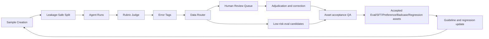

# Product PRD: Legal AI Data Governance Platform

## 1. Product Positioning

This product is a legal AI data governance workflow, not a legal question-answering product and not
a model leaderboard.

Primary operating roles:

- Professional-domain data product manager
- Legal AI evaluation and annotation workflow owner
- Human review and badcase governance coordinator

Core product question:

```text
When a legal Agent produces an incomplete, risky, or overconfident answer, how should the organization convert that failure into reusable data assets?
```

Final product artifacts:

- Leakage-safe dataset split: `Eval_Input`, `Gold_Labels`, `Rubric_Items`
- Multi-task legal evaluation workflow
- Normalized run log for multi-model and multi-version experiments
- Rubric-based Judge outputs
- Standardized error taxonomy
- Human review queue
- Error-to-data routing
- Executive dashboard for data production decisions

## 2. Target Users

Primary users:

- Legal AI data product manager
- Legal annotation operation lead
- Model evaluation engineer
- Human review coordinator

Secondary users:

- Legal domain expert reviewer
- Prompt engineer
- Model training data owner
- Compliance or risk-control reviewer

## 3. User Pain Points

Legal AI outputs are difficult to operationalize because:

- Evaluation datasets often leak gold labels into the tested Agent.
- Legal tasks are mixed together, making consultation, case analysis, and document drafting hard to
  compare.
- Wide evaluation tables do not scale to multiple models, prompt versions, and repeated runs.
- Badcases are manually discussed but not converted into standardized data assets.
- Human review queues lack clear routing rules.
- Dashboard outputs often become model rankings instead of data production decisions.

## 4. Goals

Workflow goals:

- Prevent gold label leakage in model-facing prompts.
- Support three legal task categories: consultation, case analysis, document drafting.
- Standardize rubric-based scoring across task types.
- Separate record-level `response_policy`, review `workflow_status`, group-level
  `release_gate_decision`, and multi-label data assets (`eval`, `sft`, `preference`, `badcase`,
  `regression`).
- Provide a dashboard that tells the data team what to produce next.
- Keep the workflow reproducible from local files and CLI commands.

Success criteria:

- Agents never receive protected gold fields.
- Judge can access `Gold_Labels` and `Rubric_Items`.
- V2 blind review cannot access gold labels.
- One model run maps to one normalized run log row.
- Every Judge score maps to a workflow status, a response policy, and zero or more candidate data
  assets; group-level deployment evaluation produces a separate release-gate decision.
- Dashboard can support a 3-minute product walkthrough.

## 5. Non-Goals

This workflow will not:

- Provide legal advice to end users.
- Rank models as winners or losers.
- Perform open-web legal retrieval or unsupervised automatic legal citation discovery.
- Build a Web UI.
- Store data in a database.
- Replace lawyer or legal expert review.
- Claim final legal correctness.

## 6. Core Scenarios

### Scenario A: Dataset Designer Creates A Leakage-Safe Eval Set

The data owner separates model-visible input from judge-only labels.

Key requirements:

- `Eval_Input` includes only prompt-visible facts and metadata.
- `Gold_Labels` includes missing facts, expected questions, expected answer points, risks, and human
  review notes.
- `Rubric_Items` includes atomic scoring items and criticality.

### Scenario B: Evaluation Owner Runs Multi-Version Experiments

The evaluation owner runs V0/V3 full diagnostic runs and V1/V2 deep badcase supplements.

Key requirements:

- Run log is normalized.
- Each run records model alias, prompt version, visible input fields, output text, status, and
  timestamp.
- V0/V3 are not duplicated in the deep supplement.

### Scenario C: Judge Scores And Tags Failures

The Judge evaluates outputs with task-specific rubrics.

Key requirements:

- Consultation judge focuses on missing facts, clarification, and risk boundary.
- Case analysis judge focuses on conclusion, facts, reasoning, and basis.
- Document drafting judge focuses on structure, claims or defenses, fact organization, and risk
  omissions.
- Judge returns dimension scores, atomic scores, error tags, risk level, confidence, and human
  review flag.

### Scenario D: Router Converts Failures Into Workflow And Data Actions

The router maps each score row into three separate decisions.

Routing examples:

- High risk or low confidence -> `workflow_status=pending_review`, `response_policy=human_review`
- Fabricated citation or unsafe action -> `response_policy=block`, candidate assets
  `badcase+regression`
- Overclaim -> assets `preference+regression`
- Missing facts -> `response_policy=clarify`, candidate asset `sft`
- Weak fact-rule application -> asset `eval`

### Scenario E: Product Manager Reviews Dashboard

The product manager uses the dashboard to decide next data production priorities.

Expected dashboard questions:

- Which task categories have higher review pressure?
- Which error tags dominate?
- How large is the human review queue?
- Which badcases should become regression tests?
- Which patterns should become SFT or preference data?

## 7. Feature List

| Feature                     | User Value                                       | Priority | Status       |
| --------------------------- | ------------------------------------------------ | -------- | ------------ |
| Eval/Gold/Rubric split      | Prevents leakage and clarifies data ownership    | P0       | Done         |
| Prompt visibility control   | Enforces model-facing field restrictions         | P0       | Done         |
| Multi-task task_category    | Supports consultation/case/drafting coverage     | P0       | Done         |
| Normalized run log          | Supports multi-model and multi-version runs      | P0       | Done         |
| Task-specific Judge prompts | Aligns evaluation with legal task type           | P0       | Done         |
| Error taxonomy              | Enables aggregation and routing                  | P0       | Done         |
| Data router                 | Separates response policy, review state, and asset candidates | P0 | Done |
| Executive dashboard         | Supports product decision review                 | P0       | Done; canonical schema |
| Labeling SOP                | Supports scalable annotation operations          | P0       | Done         |
| API pilots                  | Validate hosted-provider integration and product signals | P1 | Completed at pilot scale |
| Controlled RAG pilot        | Tests retrieval, source boundary, citation, and claims | P1 | Completed at pilot scale |
| A5 multi-turn pilot         | Validates trace logging and review design        | P1       | 24 traces; human calibration pending |
| Web UI                      | Nice-to-have for operations                      | P3       | Not included |
| Production legal retrieval | Authoritative, versioned legal knowledge service | P3       | Not included |

## 8. Prioritization

P0:

- Gold label isolation
- Normalized run log
- Task-specific Judge
- Fixed data routes
- Labeling SOP
- Dashboard

P1:

- Small real API smoke run
- Badcase card curation
- Preference pair template
- Human review QA checklist

P2:

- Batch annotation audit sampling
- Inter-annotator agreement metrics
- Cost and latency tracking

P3:

- Web UI
- Database
- Automated legal retrieval
- Large-scale model comparison

## 9. Metrics Tree

North Star:

- Percentage of risky legal AI records reviewed and accepted into fit-for-purpose data assets.

Input quality metrics:

- Dataset coverage by task category
- Gold label completeness rate
- Rubric item coverage per sample
- Protected-field leakage incidents

Evaluation metrics:

- Run success rate
- Judge `parsed_ok` rate
- Average score rate by prompt version
- V3 vs V0 score delta

Risk metrics:

- High risk rate
- Human review queue size
- P0 unsafe-output miss rate
- Human-review routing precision and recall on a random calibration sample
- Low judge confidence rate
- Fabricated citation rate
- Overclaim rate

Data production metrics:

- Multi-label asset distribution across `eval`, `sft`, `preference`, `badcase`, `regression`
- Reusable gold sample count
- Preference pair candidate count
- SFT candidate acceptance rate

Operational metrics:

- Time from badcase detection to route decision
- Human review backlog size
- Cost per safely released answer
- Median reviewer turnaround time
- Time from confirmed badcase to regression-test inclusion
- Rework rate after human review
- Annotation guideline violation rate

## 10. Acceptance Criteria

Dataset:

- `Eval_Input` contains no protected gold fields.
- `Gold_Labels` and `Rubric_Items` are not visible to V0/V1/V2/V3 prompts.
- `sample_id` is stable across all files.

Prompt:

- V2 blind review receives only allowed fields and V0 output.
- Judge prompt receives gold labels and rubric items.
- Task-specific judge prompt is selected by `task_category`.

Run log:

- One row equals one model run.
- `run_id` is unique.
- `input_visible_fields` is populated.
- `run_status` and `output_length` are populated.

Judge:

- `score_rate = total_score / max_score`.
- `dimension_scores` uses the unified dimensions.
- `parsed_ok` is recorded.
- Invalid error tags are normalized.

Router:

- `workflow_status`, `response_policy`, and `data_asset_routes` are populated separately.
- High risk or low confidence becomes `pending_review` with `response_policy=human_review`.
- Fabricated citation blocks release and becomes `badcase + regression` after review.
- Group-level output uses `release_gate_decision`; the legacy `release_decision` alias is not used
  for internal routing logic.

Dashboard:

- Shows sample count, run count, score delta, high-risk rate, and human review queue.
- Shows dataset coverage and task category summary.
- Shows badcase cards with data action.
- Does not rank models.

## 11. Business Flow



## 12. Risks And Mitigations

| Risk                             | Impact                    | Mitigation                                               |
| -------------------------------- | ------------------------- | -------------------------------------------------------- |
| Gold label leakage               | Invalid evaluation        | Strict file split and prompt visibility tests            |
| Judge instability                | Incorrect routing         | `parsed_ok`, judge confidence, and human review fallback |
| Over-reliance on mock mode       | Weak external credibility | Keep mock and API evidence layers explicitly separated  |
| Ambiguous labels                 | Inconsistent annotation   | Labeling SOP and examples                                |
| Dashboard misread as leaderboard | Wrong product framing     | README and dashboard boundary language                   |
| Legal correctness overclaim      | Compliance risk           | Boundary statements and human review triggers            |

## 13. Current Iteration Plan

Immediate:

- Human-review all 24 A5 traces and calibrate the regenerated deterministic flags against those
  labels.
- Retain legacy aliases only while downstream consumers migrate; keep all internal decisions on
  `response_policy`, `workflow_status`, `data_asset_routes`, and `release_gate_decision`.
- Preserve anonymous reviewer A/B and adjudicated labels for reproducible IAA.

Next pilot:

- Add a random review stratum alongside priority review.
- Preregister release metrics and thresholds.
- Add claim/evidence span labels and authoritative source-version metadata.
- Track annotation cost, turnaround time, backlog, and badcase-to-regression lead time.

Later:

- Add storage and reviewer-assignment workflow only after the schema stabilizes.
- Add a Web UI only after CLI, lineage, and QA workflows are validated.

## 14. Launch Checklist

- README first screen explains the core problem, evaluation flow, and reviewable artifacts.
- PRD and SOP are linked.
- Dashboard preview image is visible.
- Synthetic/mock Dashboard and full CSVs are reproducible locally but are not presented as public
  empirical evidence.
- Public evidence packages contain only clearly labeled API summaries and redacted samples.
- Tests and validation pass.
- Repository topics and description are configured.

## Next Steps in a Real Product Team

This project validates an offline data and evaluation loop using controlled samples and pilot outputs. In a real product team, the next step would be to connect the same workflow to broader product evidence, including:

- Redacted real user query logs.
- Lawyer-reviewed answer samples.
- User feedback signals such as escalation, report, retry, and abandonment.
- Jurisdiction-specific legal content governance.
- Annotation QA and reviewer calibration.
- Post-release regression monitoring after model, prompt, or RAG changes.

These additions would extend the evidence base for product decisions. They are not claimed as completed in this repository.
